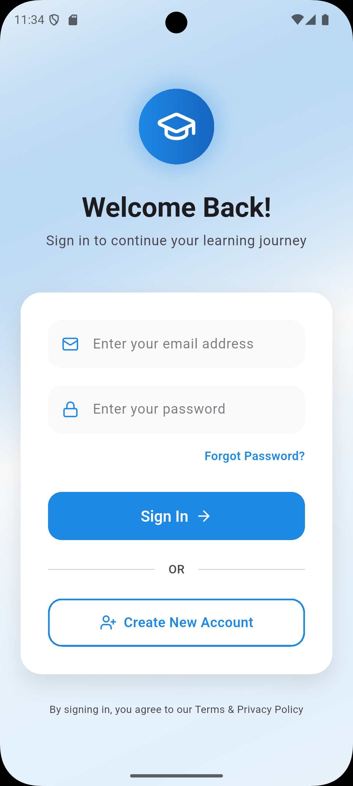
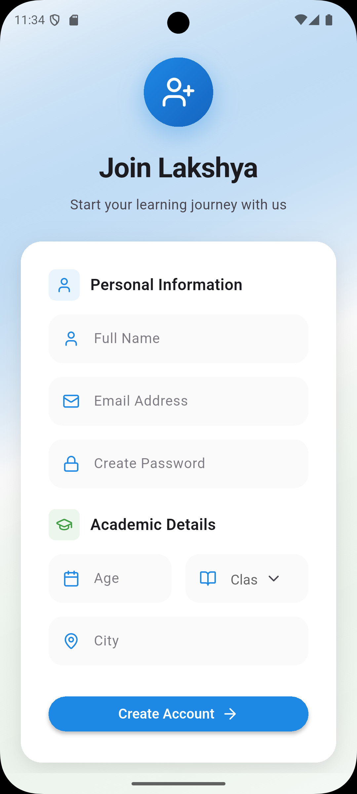
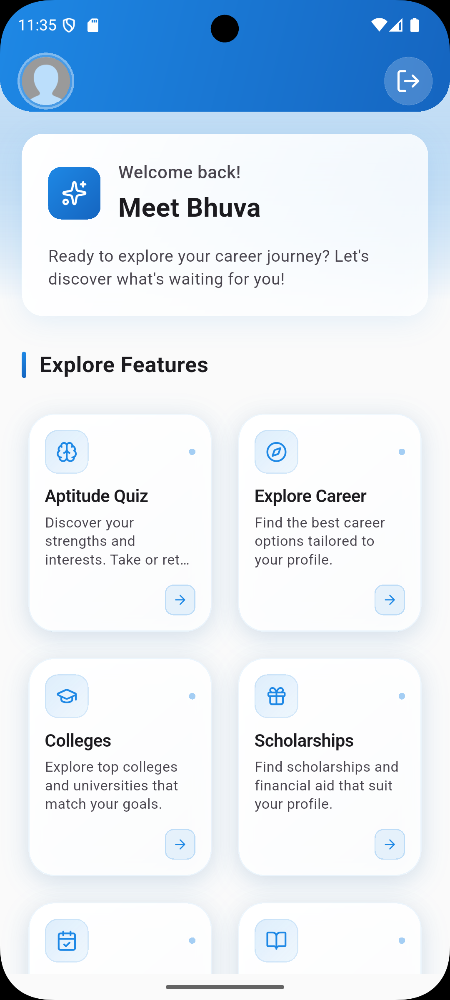
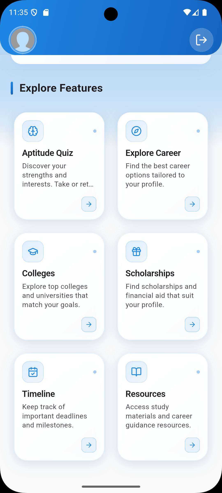
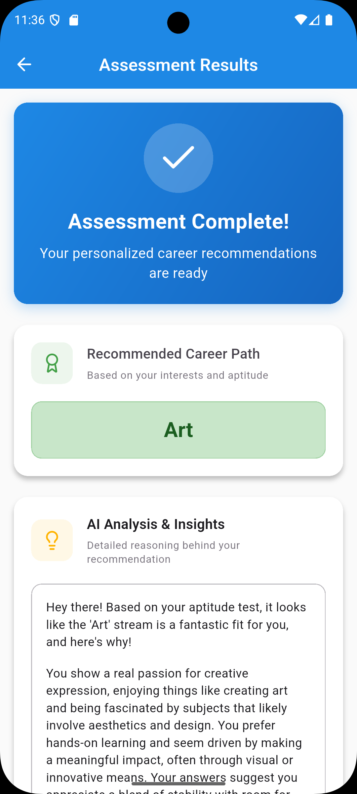
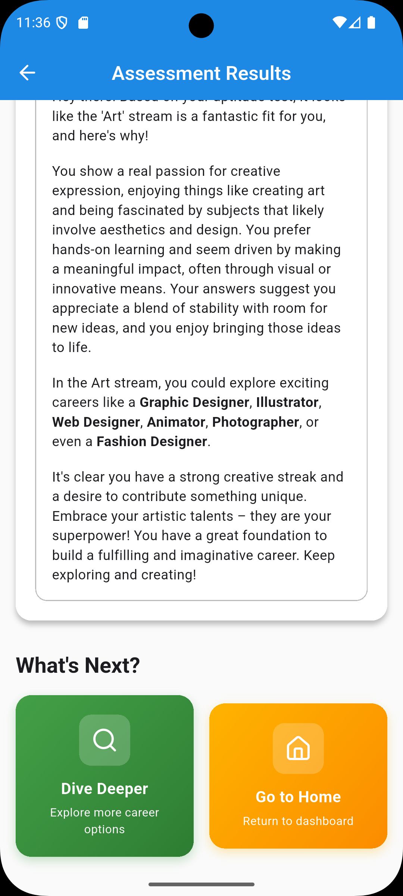
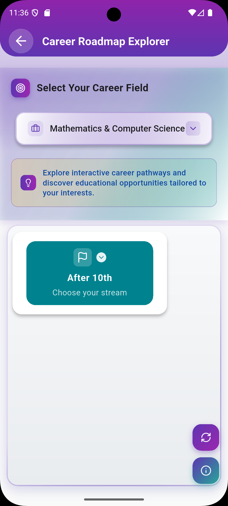
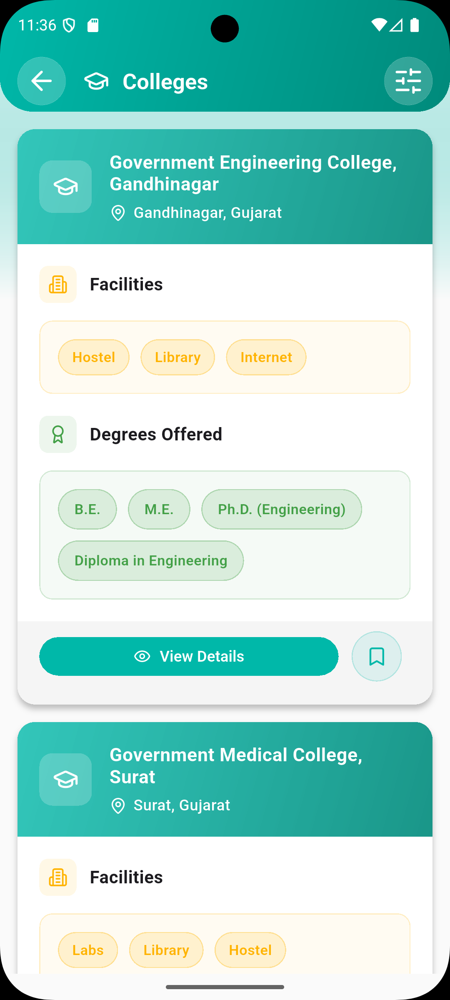
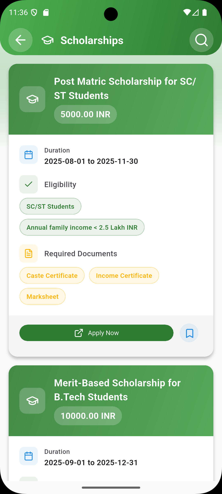
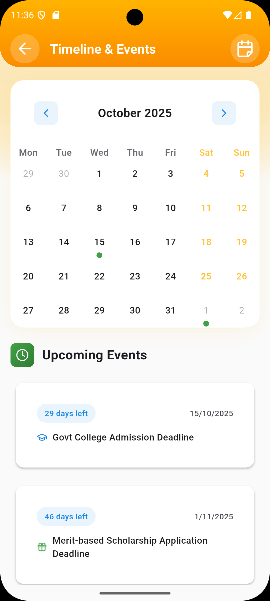

# 🎯 Lakshya - AI-Powered Career Guidance Platform

[](https://flutter.dev/)
[](https://fastapi.tiangolo.com/)
[](https://www.python.org/)
[](LICENSE)

**Lakshya** is a comprehensive AI-powered career guidance platform designed to help students make informed decisions about their educational and career paths. Developed for Smart India Hackathon 2025, this application provides personalized recommendations, interactive career roadmaps, and comprehensive course-career mapping to guide students towards their ideal career trajectory.

## 🌟 Key Features

### 🎓 **Intelligent Career Assessment**

- **AI-Powered Questionnaire**: Comprehensive assessment to understand student interests, aptitudes, and preferences
- **Personalized Recommendations**: ML-driven recommendations based on individual responses
- **Multi-Domain Analysis**: Covers Science, Commerce, Arts, Technology, and more

### 🗺️ **Interactive Career Roadmaps**

- **Visual Career Mapping**: Interactive graph-based visualization of career paths
- **Course-Career Integration**: Direct mapping between educational courses and career opportunities
- **Expandable Nodes**: Explore specializations, key subjects, higher education options, and job roles
- **Multi-Platform Support**: Touch interactions with zoom, pan, and tap-to-expand functionality

### 📚 **Comprehensive Database**

- **Course Information**: Detailed information about various educational programs
- **College Recommendations**: Curated list of institutions for different career paths
- **Scholarship Opportunities**: Information about financial aid and scholarship programs
- **Career Insights**: Industry trends, job market analysis, and growth opportunities

### 🤖 **AI-Enhanced Recommendations**

- **Gemini AI Integration**: Advanced natural language processing for career guidance
- **Contextual Suggestions**: Recommendations based on current market trends and future projections
- **Personalized Learning Paths**: Customized educational sequences for optimal career preparation

### 📱 **Modern User Experience**

- **Responsive Design**: Seamless experience across different screen sizes
- **Intuitive Navigation**: User-friendly interface with smooth animations

## 📱 Application Screenshots

<div align="center">

<table>
  <tr>
    <td align="center">
      
      <br><b>Login Screen</b>
    </td>
    <td align="center">
      
      <br><b>Register Screen</b>
    </td>
  </tr>
</table>

<table>
  <tr>
    <td align="center">
      
      <br><b>Home Screen</b>
    </td>
    <td align="center">
      
      <br><b>Features</b>
    </td>
  </tr>
</table>

<table>
  <tr>
    <td align="center">
      
      <br><b>Assessment Results</b>
    </td>
    <td align="center">
      
      <br><b>Assessment Results</b>
    </td>

  </tr>
</table>

<table>
  <tr>
    <td align="center">
      
      <br><b>Course Details</b>
    </td>
    <td align="center">
      
      <br><b>College List</b>
    </td>
  </tr>
</table>

<table>
  <tr>
      <td align="center">
      
      <br><b>scholarship list</b>
    </td>
    <td align="center">
      
      <br><b>Timeline Tracker</b>
    </td>
</table>

</div>

---

## 🛠️ Technology Stack

### **Frontend Technologies**

| Technology         | Purpose                         | Version |
| ------------------ | ------------------------------- | ------- |
| **Flutter**        | Cross-platform mobile framework | 3.9.0+  |
| **Dart**           | Programming language            | Latest  |
| **Riverpod**       | State management                | 2.6.1   |
| **Dio**            | HTTP client for API calls       | 5.9.0   |
| **GraphView**      | Interactive graph visualization | 1.2.0   |
| **GetWidget**      | Pre-built UI components         | 7.0.0   |
| **Flutter Lucide** | Modern icon library             | 1.7.0   |

### **Backend Technologies**

| Technology            | Purpose                     | Version |
| --------------------- | --------------------------- | ------- |
| **FastAPI**           | Modern Python web framework | Latest  |
| **SQLAlchemy**        | Database ORM                | Latest  |
| **Pydantic**          | Data validation             | Latest  |
| **Uvicorn**           | ASGI server                 | Latest  |
| **Google Gemini AI**  | AI/ML recommendations       | Latest  |
| **PostgreSQL/SQLite** | Database                    | Latest  |

### **Development Tools**

- **VS Code** - Primary IDE
- **Android Studio** - Android development
- **Swagger** - API testing
- **Git** - Version control
- **Docker** - Containerization

## 📋 Prerequisites

Before setting up Lakshya, ensure you have the following installed:

### **System Requirements**

- **Operating System**: Windows 10/11, macOS 10.14+, or Linux (Ubuntu 18.04+)
- **RAM**: 8GB minimum, 16GB recommended
- **Storage**: 10GB free space
- **Internet**: Required for initial setup and AI features

### **Software Dependencies**

#### **Flutter Development**

```bash
# Flutter SDK
flutter --version  # Should be 3.9.0 or higher

# Platform-specific requirements
# Android: Android Studio + Android SDK (API 21+)
# iOS: Xcode 14+ (macOS only)
```

#### **Backend Development**

```bash
# Python
python --version  # Should be 3.9 or higher

# Package manager
pip --version
```

#### **Database (Optional)**

- **PostgreSQL** 13+ (Production)
- **SQLite** (Development - included with Python)

## 🚀 Installation & Setup

### **1. Clone the Repository**

```bash
git clone https://github.com/Meet-08/SIH2025-Prototype.git
cd SIH2025-Prototype
```

### **2. Backend Setup (FastAPI)**

#### **Navigate to Backend Directory**

```bash
cd backend
```

#### **Create Virtual Environment**

```bash
# Windows
python -m venv myenv
myenv\Scripts\activate

# macOS/Linux
python3 -m venv myenv
source myenv/bin/activate
```

#### **Install Dependencies**

```bash
pip install -r requirements.txt
```

#### **Environment Configuration**

```bash
# Create .env file
cp .env.example .env

# Edit .env with your configurations
# Add your Gemini AI API key
GEMINI_API_KEY=your_gemini_api_key_here
DATABASE_URL=sqlite:///./app.db
```

#### **Database Setup**

```bash
# Initialize database (automatically handled by main.py)
python main.py
```

#### **Start Backend Server**

```bash
# Development server
uvicorn main:app --reload --host 0.0.0.0 --port 8000

# Production server
uvicorn main:app --host 0.0.0.0 --port 8000
```

The API will be available at `http://localhost:8000`
API documentation at `http://localhost:8000/docs`

### **3. Frontend Setup (Flutter)**

#### **Navigate to Flutter Directory**

```bash
cd ../lakshya-ui
```

#### **Install Dependencies**

```bash
flutter pub get
```

#### **Environment Configuration**

```bash
# Create .env file in lakshya-ui directory
touch .env

# Add backend URL
echo "API_BASE_URL=http://localhost:8000/v1/api" >> .env
```

#### **Run the Application**

**For Development:**

```bash
# Run on connected device/emulator
flutter run

# Run with specific device
flutter devices
flutter run -d <device_id>

# Run in debug mode with hot reload
flutter run --debug
```

**For Production:**

```bash
# Build APK (Android)
flutter build apk --release

# Build IPA (iOS - macOS only)
flutter build ios --release

# Build for web
flutter build web
```

## 📱 Usage Guide

### **Getting Started**

1. **Launch the App**: Open Lakshya on your device
2. **Student Login**: Create an account or login with existing credentials
3. **Assessment**: Complete the comprehensive career assessment questionnaire
4. **Results**: View your personalized career recommendations
5. **Explore**: Navigate through interactive career roadmaps and course information

### **Key Features Usage**

#### **Career Assessment**

- Answer questions about your interests, skills, and preferences
- Each question is designed to understand your aptitude for different career domains
- Take your time - honest answers lead to better recommendations

#### **Interactive Career Roadmap**

- **Navigation**: Use pinch-to-zoom and drag gestures
- **Exploration**: Tap on nodes to expand career paths
- **Information**: Long-press for detailed information
- **Reset**: Use the refresh button to reset the view

#### **Course Recommendations**

- Browse recommended courses based on your assessment
- View detailed information about duration, specializations, and career prospects
- Explore college options and scholarship opportunities

## 🔧 API Documentation

### **Base URL**

```
http://localhost:8000/v1/api
```

### **Key Endpoints**

#### **Student Management**

```http
POST   /student                    # Create student profile
GET    /student/{id}               # Get student details
PUT    /student/{id}               # Update student profile
```

#### **Career Recommendations**

```http
POST   /recommendation             # Get career recommendations
GET    /recommendation/{id}        # Get specific recommendation
```

#### **Career Roadmaps**

```http
GET    /course_career/roadmaps/{field}  # Get career roadmap for specific field
GET    /course_career/courses           # Get all courses
GET    /course_career/careers           # Get all careers
```

#### **Educational Resources**

```http
GET    /course                     # Get all courses
GET    /course/{id}                # Get specific course
GET    /college                    # Get all colleges
GET    /scholarship                # Get all scholarships
```

## 🤝 Contributing

We welcome contributions to make Lakshya even better! Here's how you can contribute:

### **Development Setup**

1. Fork the repository
2. Create a feature branch (`git checkout -b feature/AmazingFeature`)
3. Set up development environment following the installation guide
4. Make your changes with appropriate tests
5. Commit your changes (`git commit -m 'Add some AmazingFeature'`)
6. Push to the branch (`git push origin feature/AmazingFeature`)
7. Open a Pull Request

### **Contribution Guidelines**

- Follow the existing code style and conventions
- Write comprehensive tests for new features
- Update documentation for any API changes
- Ensure all tests pass before submitting PR
- Add meaningful commit messages

## 🔒 Security & Privacy

### **Data Protection**

- All user data is encrypted in transit and at rest
- Personal information is handled according to privacy best practices
- No sensitive data is logged or shared with third parties
- Assessment responses are anonymized for analytics

### **API Security**

- Input validation and sanitization
- Rate limiting to prevent abuse
- CORS configuration for secure cross-origin requests
- Environment variables for sensitive configuration

## 📈 Performance Optimization

### **Frontend Optimization**

- **Image Optimization**: Use appropriate image formats and sizes
- **State Management**: Efficient Riverpod state updates
- **Memory Management**: Proper disposal of controllers and streams
- **Build Optimization**: Use `const` widgets where possible

### **Backend Optimization**

- **Database Indexing**: Optimize queries with proper indexes
- **Caching**: Implement Redis for frequently accessed data
- **Connection Pooling**: Configure optimal database connections
- **API Rate Limiting**: Prevent resource exhaustion

## 📄 License

This project is licensed under the MIT License. See the [LICENSE](LICENSE) file for details.

```
MIT License

Copyright (c) 2025 Team Stack Nova - SIH 2025

Permission is hereby granted, free of charge, to any person obtaining a copy
of this software and associated documentation files (the "Software"), to deal
in the Software without restriction, including without limitation the rights
to use, copy, modify, merge, publish, distribute, sublicense, and/or sell
copies of the Software, and to permit persons to whom the Software is
furnished to do so, subject to the following conditions:

The above copyright notice and this permission notice shall be included in all
copies or substantial portions of the Software.

THE SOFTWARE IS PROVIDED "AS IS", WITHOUT WARRANTY OF ANY KIND, EXPRESS OR
IMPLIED, INCLUDING BUT NOT LIMITED TO THE WARRANTIES OF MERCHANTABILITY,
FITNESS FOR A PARTICULAR PURPOSE AND NONINFRINGEMENT. IN NO EVENT SHALL THE
AUTHORS OR COPYRIGHT HOLDERS BE LIABLE FOR ANY CLAIM, DAMAGES OR OTHER
LIABILITY, WHETHER IN AN ACTION OF CONTRACT, TORT OR OTHERWISE, ARISING FROM,
OUT OF OR IN CONNECTION WITH THE SOFTWARE OR THE USE OR OTHER DEALINGS IN THE
SOFTWARE.
```

## 👥 Team & Acknowledgments

### **Team Stack Nova - SIH 2025**

- **Meet Bhuva**
- **Swara Natekar**
- **Het Goswami**
- **Janvi Bhanderi**
- **Vraj Gauswami**
- **Daivagna Parmar**

### **Special Thanks**

- **Smart India Hackathon 2025** for providing the platform
- **Google Gemini AI** for advanced recommendation capabilities
- **Flutter Community** for excellent development resources
- **FastAPI Community** for robust backend framework
- **Open Source Contributors** who made this project possible

### **Feedback & Support**

- **Issues**: [GitHub Issues](https://github.com/Meet-08/SIH2025-Prototype/issues)
- **Discussions**: [GitHub Discussions](https://github.com/Meet-08/SIH2025-Prototype/discussions)
- **Email**: Contact through GitHub profile

---

<div align="center">

**🎯 Lakshya - Empowering Students to Achieve Their Career Goals**

[](https://flutter.dev/)
[](https://fastapi.tiangolo.com/)
[](https://ai.google.dev/)

_Built with ❤️ by Team Stack Nova for SIH 2025_

</div>
